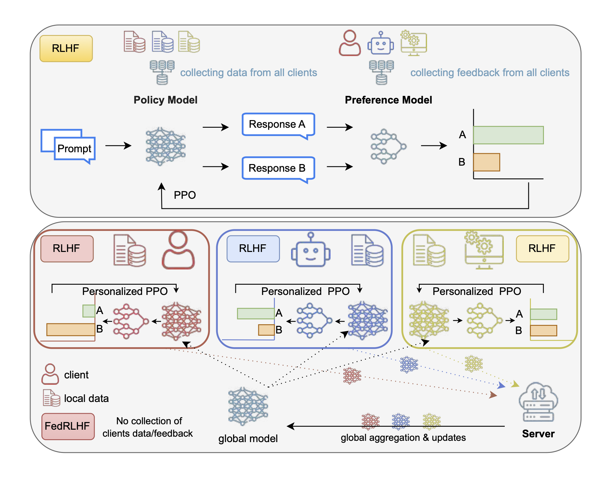

# FedRLHF: A Convergence-Guaranteed Framework for Privacy-Preserving and Personalized RLHF

[](https://aamas2025.com)  

[](FedRLHF-problem.pdf)

## Overview
This repository contains the official implementation of **FedRLHF: A Convergence-Guaranteed Federated Framework for Privacy-Preserving and Personalized Reinforcement Learning with Human Feedback**, as presented at **AAMAS 2025**. 

FedRLHF combines federated learning principles with reinforcement learning from human feedback (RLHF) to provide:

- **Privacy-Preserving Training**: Securely train models without sharing raw data between clients.
- **Personalized Reinforcement Learning**: Incorporate human feedback to personalize the policy.
- **Convergence Guarantees**: Rigorous proofs for convergence under federated settings.

---

## Features
- **Two Benchmark Tasks**:
  - IMDb (Sentiment Analysis + Reward Modeling)
  - MovieLens (Recommendation Systems with Federated Policies)
- **Components**:
  - Federated Server and Client implementations.
  - Reward Modeling and Policy Optimization.
  - Tools for Visualization and Performance Analysis.
- **Live Demo**: Showcase of personalization using pre-trained models (planned).

---

## Repository Structure

```plaintext
FedRLHF/
├── IMDb/                        # IMDb-based federated RLHF task
│   ├── centralized_training.py
│   ├── server.py
│   ├── client.py
│   ├── config.py
│   ├── plot_combined_performance.py
│   ├── visualize_rewards_trends.py
│   ├── req.txt                  # Dependencies
│   └── start_multiple_clients.bash
├── MovieLens/                   # MovieLens-based federated RLHF task
│   ├── fed_rlhf/                # Core FedRLHF Implementation
│   │   ├── server.py
│   │   └── client.py
│   ├── utils/                   # Utilities for metrics and visualization
│   ├── models/                  # Reward and Base Models
│   ├── data/                    # Dataset loading
│   ├── environment.yml          # Conda environment setup
│   └── main.py                  # Entry point for MovieLens experiments
└── README.md
```

---

## Getting Started

### Prerequisites

Ensure you have the following installed:
- Python >= 3.8
- Conda or Virtualenv (for environment setup)

### Setup

1. **Clone the Repository**:
   ```bash
   git clone https://github.com/flint-xf-fan/Federated-RLHF.git
   cd Federated-RLHF
   ```

2. **Install Dependencies**:
   For IMDb:
   ```bash
   pip install -r IMDb/req.txt
   ```
   For MovieLens:
   ```bash
   conda env create -f MovieLens/environment.yml
   conda activate fedrlhf
   ```

### Running Experiments

#### IMDb
TODO

#### MovieLens
TODO

---

## Citation
If you use this code in your research, please cite the following paper (preprint):

```bibtex
@article{fan2024fedrlhf,
  title={FedRLHF: A Convergence-Guaranteed Federated Framework for Privacy-Preserving and Personalized RLHF},
  author={Fan, Flint Xiaofeng and Tan, Cheston and Ong, Yew-Soon and Wattenhofer, Roger and Ooi, Wei-Tsang},
  journal={arXiv preprint arXiv:2412.15538},
  year={2024}
}
```

TODO: replace the preprint with aamas version.

---

## License
See the aamas license documentation.

---

## Contact
For questions or collaboration inquiries, please contact:
- **Name**: Flint
- **Email**: fxf@u.nus.edu

---

Enjoy using FedRLHF!
